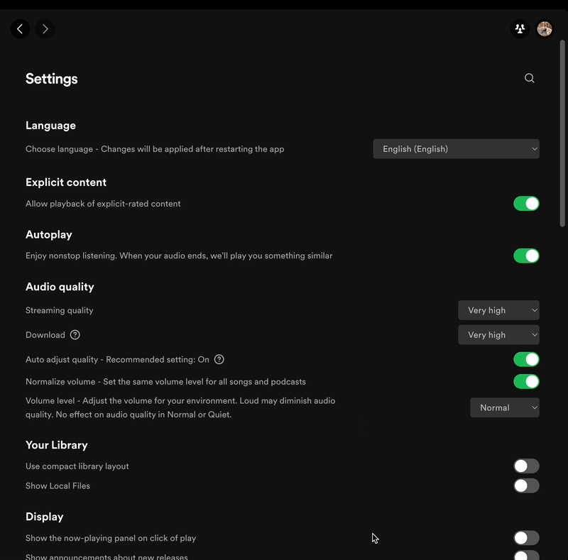
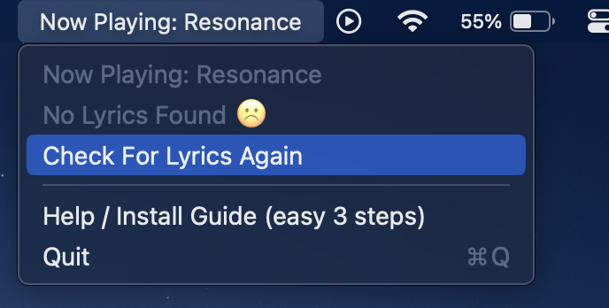

# Spotify Lyrics In Menubar Help

If the lyrics aren't showing up, here's a few steps you can take.

## 1. Make sure Spotify is installed on your mac

Please download the official [Spotify Desktop client](https://www.spotify.com/in-en/download/mac/)

## 2. Make sure you give Automation permission

We need this permission to read the current song from Spotify, so that we can play the correct lyrics! Watch the following gif to correctly give permission.

## 3. Make sure you disable crossfades

Because of a glitch within Spotify, crossfades make the lyrics appear slow on occasion. I've informed them. Till then, the solution is to disable crossfades. Watch the following gif to correctly give permission.

## 4. Check for Lyrics again

If you're sure the playing song has lyrics but for some reason they aren't showing up, click the Check for lyrics again button to retry a download.

## 5. If all else fails, please shoot me an email

I'd be more than happy to help you. Please email me at [aviwad@gmail.com](mailto:aviwad@gmail.com)