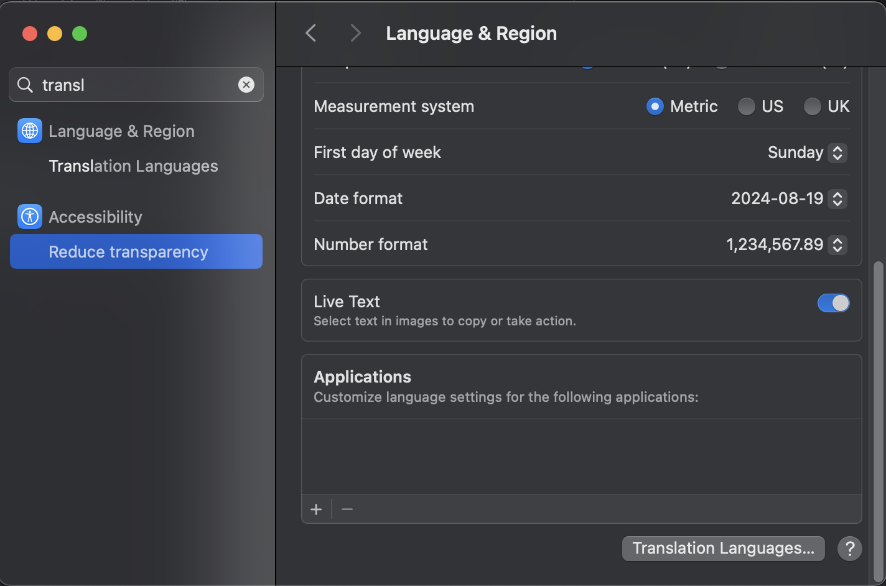
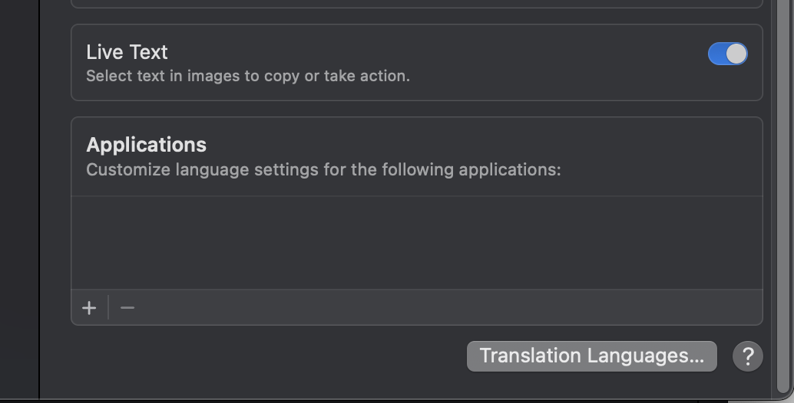
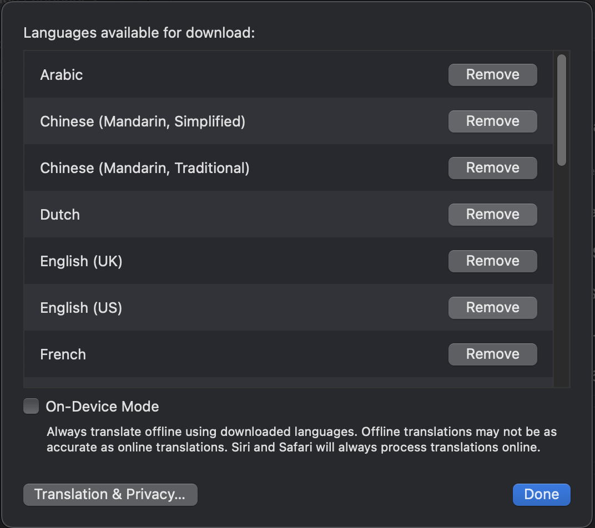

# LyricFever Translation Setup

You must download translation languages first before LyricFever can translate anything. It's very quick.

## Download all translation languages

### Open Language & Region in System Settings

[Click here to open the Language & Region page](x-apple.systempreferences:com.apple.Localization-Settings.extension)

<!-- {width=30%} -->

### Click on Translation Languages

### Download all the relevant languages

For example, if your system language is English and you want to translate a Korean song, you must have both Korean and English installed.

IMPORTANT: For English, please download English (US). 

## If all else fails, please shoot me an email

I'd be more than happy to help you. Please email me at [aviwad@gmail.com](mailto:aviwad@gmail.com)